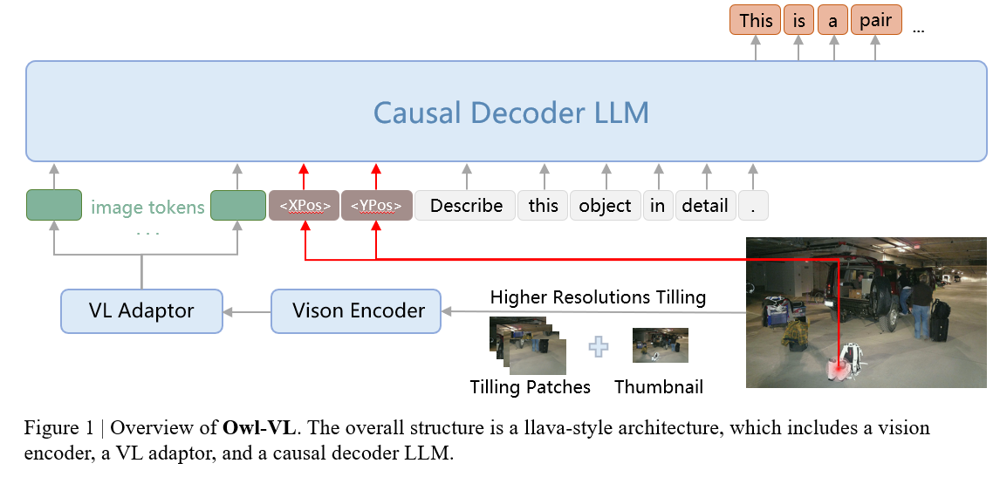
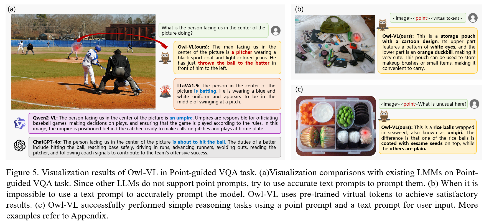
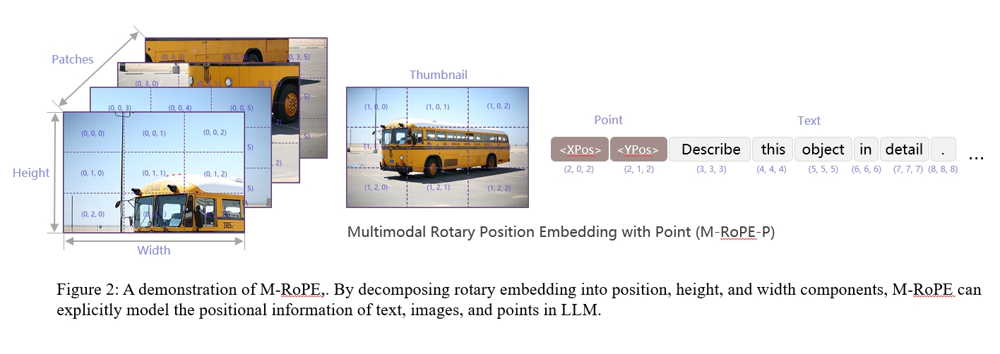
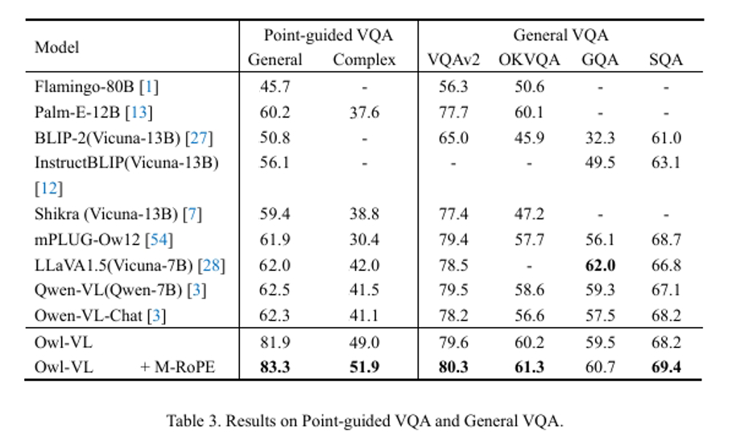
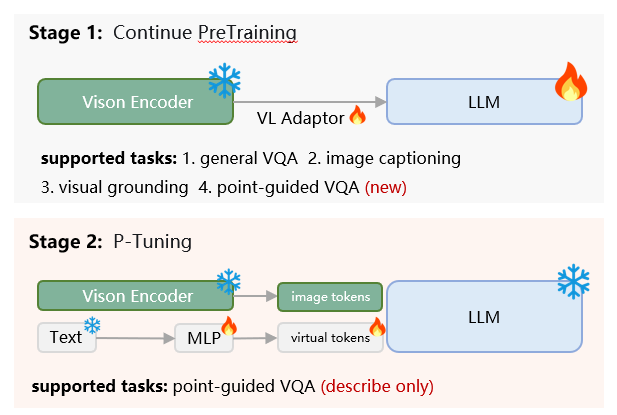
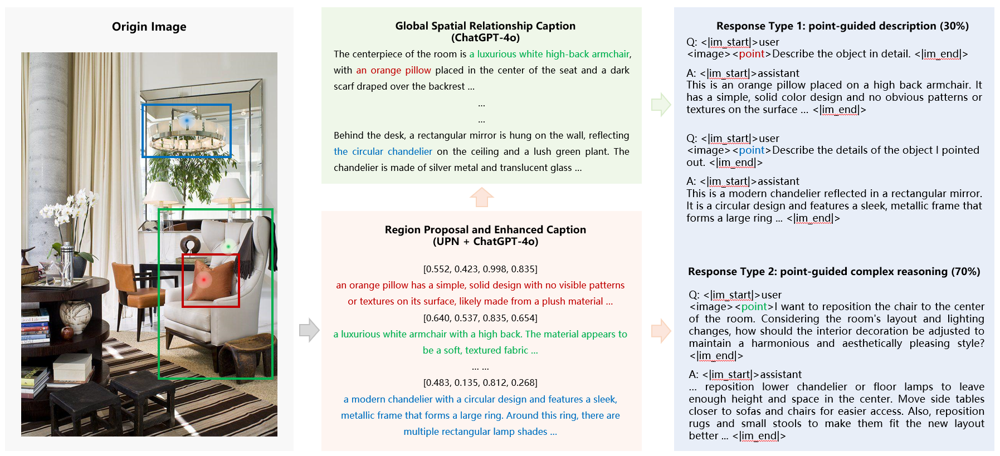

# Owl-VL: Point-Driven Vision-Language Model Focuses on What You See

<font size=7><div align='center'><b>Owl-VL</b>: <b>P</b>oint-Driven <b>V</b>ision-Language Model <b>F</b>ocuses on <b>W</b>hat You See</div></font>

<p align="center">  </p>

## Abstract
In this work, we propose **Owl-VL**, a vision-language model that incorporates an input for the point of focus. This innovation enables the model to generate different responses for the same image, depending on the input focus. We introduce M-Rope, a multi-dimensional rotary position encoding, to capture the positional relationships between different modalities. The proposed model is applied in large-scale street view environments, demonstrating its potential for AI assistants in wearable devices such as smart glasses.
For more details, please refer to the [paper].

<p align="center">  </p>

## Highlights
**Owl-VL** unlocks the new focused interaction capabilities of multi-modal models, and can handle cases involving:
1. **adaptive responses to different focuses**: generating distinct outputs for the same image based on varied point prompt；
2. **cross-modal positional relationship capture**: leveraging M-Rope to effectively capture positional relationships between different modalities;
3. **large-scale street view application**: being applicable in large-scale street view environments, providing possibilities for AI assistants in wearable devices such as smart glasses.

<p align="center">  </p>


## Experimental results
<p align="center">  </p>

## Installation
```
pip install -r requirements.txt
pip install flash-attn --no-build-isolation
```

## Training

### Pre-trained weights

You can contact us via [email](guojiaxuan@stu.xidian.edu.cn) to obtain the trained owl-vl weights, or you can reproduce our training process through the following steps.

#### LLaVA
To train owl-7B or 13B, you need to follow the [instruction](https://github.com/haotian-liu/LLaVA/blob/main/docs/MODEL_ZOO.md) to merge the LLaVA delta weights. Typically, we use the final weights `LLaVA-Lightning-7B-v1-1` and `LLaVA-13B-v1-1` merged from `liuhaotian/LLaVA-Lightning-7B-delta-v1-1` and `liuhaotian/LLaVA-13b-delta-v1-1`, respectively. For Llama2, we can directly use the LLaVA full weights `liuhaotian/llava-llama-2-13b-chat-lightning-preview`.


### Training
<p align="center">  </p>

The training strategy of the proposed Owl-VL. It consists of two progressive stages, including continue pretraining and P-tuning. **Stage 1**: in order to maintain the VQA capability of the original model and improve the training efficiency of point tokens, four task data including general VQA, image captioning, visual grounding and point-guided VQA were integrated, with the integration ratio of 5:1:2:2. **Stage 2**:  This stage performs a standard P-tuning process, using only the description portion of the point-guided VQA data to train the virtual tokens that are replaced when there is no text prompt.

```
deepspeed --master_port=24999 train_ds.py \
  --version="PATH_TO_LLaVA" \
  --dataset_dir='./dataset' \
  --vision_pretrained="PATH_TO_SAM" \
  --dataset="sem_seg||refer_seg||vqa||reason_seg" \
  --sample_rates="9,3,3,1" \
  --exp_name="owl-7b"
```
When training is finished, to get the full model weight:
```
cd ./runs/owl-7b/ckpt_model && python zero_to_fp32.py . ../pytorch_model.bin
```

### Merge LoRA Weight
Merge the LoRA weights of `pytorch_model.bin`, save the resulting model into your desired path in the Hugging Face format:
```
CUDA_VISIBLE_DEVICES="" python merge_lora_weights_and_save_hf_model.py \
  --version="PATH_TO_LLaVA" \
  --weight="PATH_TO_pytorch_model.bin" \
  --save_path="PATH_TO_SAVED_MODEL"
```

For example:
```
CUDA_VISIBLE_DEVICES="" python3 merge_lora_weights_and_save_hf_model.py \
  --version="./LLaVA/LLaVA-Lightning-7B-v1-1" \
  --weight="owl-7b/pytorch_model.bin" \
  --save_path="./owl-7B"
```

### Validation
```
deepspeed --master_port=24999 train_ds.py \
  --version="PATH_TO_owl_HF_Model_Directory" \
  --dataset_dir='./dataset' \
  --vision_pretrained="PATH_TO_SAM" \
  --exp_name="owl-7b" \
  --eval_only
```

Note: the `v1` model is trained using both `train+val` sets, so please use the `v0` model to reproduce the validation results. (To use the `v0` models, please first checkout to the legacy version repo with `git checkout 0e26916`.)


## Dataset

The resulting Point-guided VQA dataset consists of two parts: description and complex reasoning. In the second stage of p-tuning, description VQA is used to train the virtual tokens that are replaced when there is no text prompt. The training data (10%) and validation data can be obtained [here](https://drive.google.com/drive/folders/1mrU1RoApi8enYqWZ9c3UAQyM3XSjLy63?usp=drive_link).

<p align="center">  </p>


## Acknowledgement
-  This work is built upon the [LLaVA](https://github.com/haotian-liu/LLaVA) and [Qwen2-VL](https://github.com/QwenLM/Qwen2.5-VL.git). 
